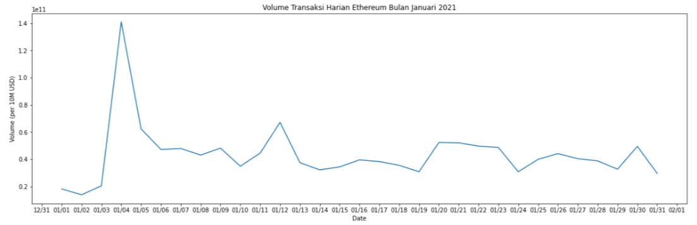

# Web-Scrapping using Beautifulsoup

## Scrapping Ethereum Daily Trading Volume 

Dikembangkan sebagai capstone project dari Algoritma Academy Data Analytics Specialization. 


Data yang diambil berupa `tanggal` serta nilai `volume` melalui website [coingecko.com](https://www.coingecko.com/en/coins/ethereum/historical_data)

### Environment preparation

```bash
$ conda create -n capstone_da python=3.8
$ conda activate capstone_da
$ conda install -c conda-forge --file requirements.txt
```

### Open Jupyter Notebook
pastikan jupyter notebook sudah terinstall  pada komputer anda
```bash
$ jupyter notebook
```


### Run web app
```bash
$ flask run
```

### Visualization

